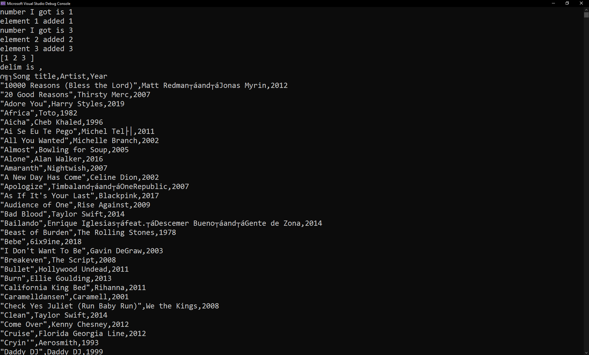

# zcut
`Print selected parts of lines from each FILE to standard output.` -Linux man page. This is my attempt to implement this tool.

## Note

AI tools were used to learn how to parse the argument -f with various possible values.

## Demo

